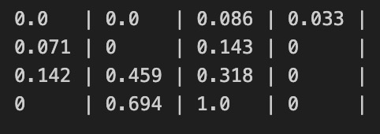
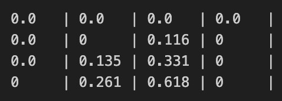
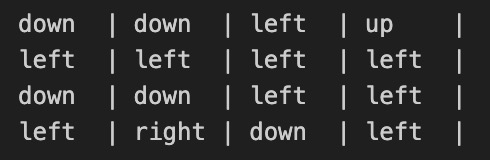
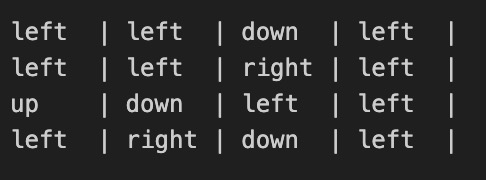
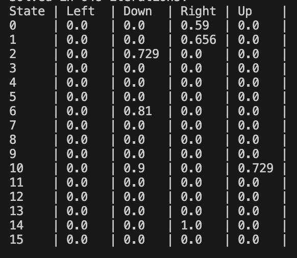
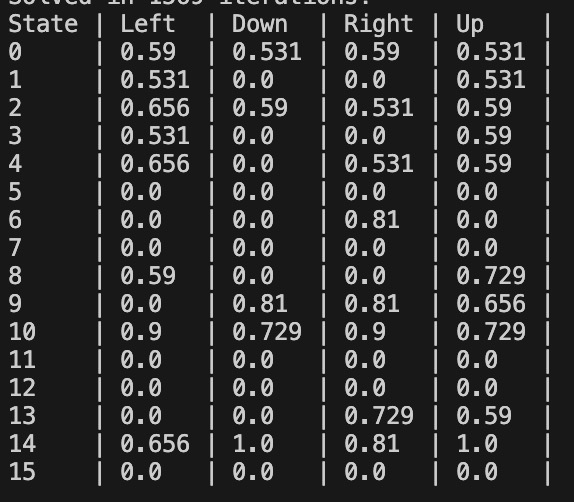
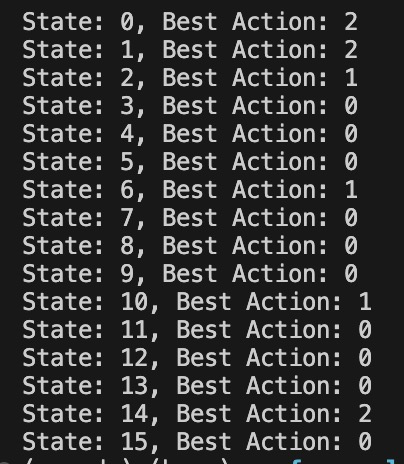
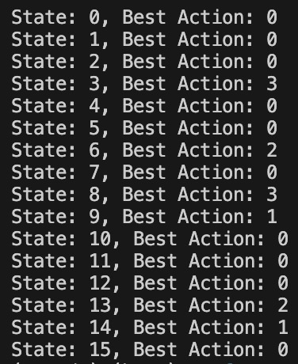

# Running the code

1. To run value iteration, `python value_iteration.py`
2. To run q-learning, `python q_learning.py`

# Frozen Lake Report for Value Iteration

Use value iteration to solve the frozen lake, experimenting with slippery set to true vs false, and seed vs no seed.

## Final value table for slippery true

### Seed set to 42:

### No seed:

## Extracted policy

### Seed set to 42:

### No seed:

## Evaluation results

### Seed set to 42:

Iterations to converge: 9

Average reward: 1

Percentage of episodes in which agent reaches the end: 100%

### No seed

Iterations to converge: 19

Average reward: 0.85

Percentage of episodes in which agent reaches the end: 85%

### Non-slippery, seed set to 42

Iterations to converge: 7

Average reward: 1

Percentage of episodes in which agent reaches the end: 100%

### Non-slippery, no seed

Iterations to converge: 6

Average reward: 1

Percentage of episodes in which agent reaches the end: 100%

## Analysis

Setting the seed yielded a policies that guaranteed the agent would reach the end for both slippery and non slippery frozen lakes. Even when the seed wasn't set, the agent still found a policy that solved non slippery frozen lake. Only when no seed was set and the frozen lake was slippery was the agent not guaranteed to reach the end. In this scenario, not only did it take a lot more iterations to convergence, but the percentage of episodes in which the agent reaches the end was at most 85%.

# Frozen Lake Report for Q-Learning

Use q learning to solve the frozen lake, experimenting with slippery set to true vs false.

## Final Q table

### Non-slippery

### Slippery

## Extracted policy

### Non-slippery

### Slippery

## Evaluation results

### Non Slippery

Iterations to converge: 648

Average reward: 1

Percentage of episodes in which agent reaches the end: 100%

### Slippery

Iterations to converge: 1569

Average reward: 0.85

Percentage of episodes in which agent reaches the end: 85%

## Analysis

The stochasticity of the environment affects q-learning. When slippery is set to true, the q learning takes significantly longer to learn the optimal policy. Furthermore, even after learning the optimal policy, the agent is only able to reach the end 85% of the time, compared to 100% of the time when slippery is set to false. 